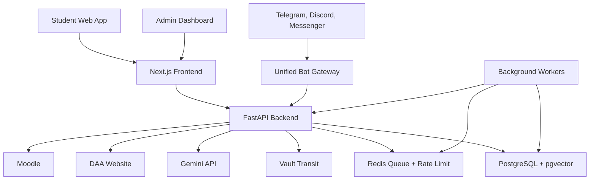

# Kế hoạch phát triển production UIT EduAdvisor

## Phạm vi và giả định
- Nguồn yêu cầu chính: [docs/UIT_EduAdvisor_PRD_v3.md](docs/UIT_EduAdvisor_PRD_v3.md).
- Phạm vi: Full v1 gồm 6 phân hệ trong PRD: Academic Tracker, Scheduler, AI Mate, Smart Tooltip, Admin Dashboard, Remote Bot.
- Hạ tầng: 1 VPS chạy Docker Compose. Đây là production tối thiểu: đủ để vận hành thật cho pilot, nhưng chưa phải high availability, nghĩa là nếu VPS chết thì hệ thống gián đoạn cho đến khi khôi phục backup.
- Repo hiện gần như chưa có code, nên kế hoạch bao gồm cả setup nền tảng, kiến trúc, dữ liệu, quy trình triển khai và vận hành.

## Kiến trúc mục tiêu

Ghi chú: Redis không có trong PRD, nhưng nên thêm cho production vì cần queue crawl DAA, rate limit, job Moodle định kỳ và retry job. Redis là bộ nhớ tạm tốc độ cao, dùng để xếp hàng và giới hạn tần suất request.

## Chiến lược triển khai theo milestone

### Milestone 0 - Nền móng kỹ thuật
Mục tiêu: tạo một skeleton chạy được end-to-end trên local và staging VPS.

- Tạo cấu trúc repo: `apps/web` cho Next.js, `apps/api` cho FastAPI, `infra` cho Docker Compose, `docs` cho tài liệu kỹ thuật.
- Chuẩn hóa môi trường: `.env.example`, config theo môi trường `local`, `staging`, `production`.
- Dựng Docker Compose gồm Next.js, FastAPI, PostgreSQL + pgvector, Redis, Vault, reverse proxy Caddy hoặc Nginx.
- Thiết lập CI cơ bản: lint, typecheck, unit test backend, unit test frontend, build Docker image.
- Thiết lập migration DB bằng Alembic.
- Thiết lập logging JSON, request id, health check `/healthz`, readiness `/readyz`.

Tiêu chí hoàn thành: deploy staging VPS bằng một lệnh, mở được frontend, gọi được backend, DB migration chạy ổn, CI xanh.

### Milestone 1 - Data model và bảo mật nền
Mục tiêu: khóa trước các quyết định bảo mật vì sản phẩm lưu MSSV + mật khẩu đã mã hóa.

- Thiết kế schema lõi: students, credentials, sync_jobs, courses, enrollments, grades, schedules, exams, deadlines, admin_users, audit_logs.
- Thiết kế schema học vụ: curricula, curriculum_terms, prerequisites, elective_groups, elective_group_courses, course_difficulty.
- Thiết kế schema AI/RAG: policy_documents, policy_chunks, embeddings, chat_summaries, pinned_messages.
- Thiết kế schema bot: bot_accounts, link_tokens, reminder_preferences.
- Tích hợp Vault Transit để mã hóa/giải mã credential. Plaintext chỉ tồn tại trong RAM trong request/job cần crawl.
- Bắt buộc consent trước khi lưu credential: Privacy Policy, Terms of Service, checkbox, timestamp consent.
- Admin auth v1: single admin, bcrypt password, session tách biệt với student session.
- Rate limit nền: crawl DAA, crawl Moodle, AI Mate, bot command.

Tiêu chí hoàn thành: credential không bao giờ lưu plaintext, audit log ghi được thao tác admin quan trọng, có test cho encryption/decryption path và consent guard.

### Milestone 2 - Authentication và onboarding sinh viên
Mục tiêu: sinh viên đăng nhập lần đầu bằng MSSV + mật khẩu, giải captcha DAA, đồng bộ dữ liệu đầu tiên.

- Frontend onboarding gồm consent flow, form MSSV/password, captcha DAA, progress step-by-step.
- Backend endpoint lấy captcha DAA, submit login, crawl dữ liệu DAA, hủy session cookie ngay sau request.
- Backend login Moodle tự động sau DAA để crawl deadline/tài liệu ban đầu.
- Tạo app session cho sinh viên bằng httpOnly secure cookie.
- Cài cơ chế xóa tài khoản/xóa credential/xóa toàn bộ dữ liệu tại Settings.
- Thêm streaming progress cho crawler: lấy captcha, login, parse điểm, parse TKB, parse Moodle, lưu DB.

Tiêu chí hoàn thành: first-time setup chạy được trên tài khoản test, sai captcha có cooldown, cookie DAA/Moodle không persist, sinh viên xóa được dữ liệu.

### Milestone 3 - Academic Tracker và GPA Suite
Mục tiêu: xây phần giá trị cốt lõi đầu tiên cho sinh viên.

- Chuẩn hóa parser DAA cho profile, bảng điểm, GPA, TKB, lịch thi.
- Xây Academic Roadmap Tree: trạng thái đã qua, đang học, rớt, chưa học/bị khóa.
- Hỗ trợ preview mode cho sinh viên năm 1 hoặc chưa sync điểm.
- Xây GPA Simulator tính realtime thang 10 và thang 4.
- Xây Reverse Calculator và Retake Estimator.
- Thêm unit test cho công thức GPA, quy đổi thang điểm, prerequisite lock, elective group status.

Tiêu chí hoàn thành: roadmap render dưới 1 giây sau khi có dữ liệu, GPA tính đúng với bộ dữ liệu mẫu đã xác nhận, UI có empty state rõ ràng.

### Milestone 4 - Admin Dashboard
Mục tiêu: tạo nguồn dữ liệu vận hành được mà không cần deploy lại.

- Course Management: CRUD môn học, tín chỉ, loại môn, độ khó, tiên quyết.
- Curriculum Management: CRUD CTĐT theo ngành, học kỳ mẫu, môn bắt buộc/tự chọn, elective groups.
- Resource Management: link Google Drive, loại tài liệu, kỳ áp dụng, ẩn/hiện.
- Tooltip Management: CRUD thuật ngữ, nội dung giải thích, link quy chế.
- Policy Management: upload PDF/DOCX, chunking, embedding vào pgvector, versioning, deprecation/restore.
- Admin audit log cho xóa/sửa dữ liệu quan trọng.

Tiêu chí hoàn thành: admin tự cập nhật CTĐT, quy chế, tài liệu, tooltip; mọi thao tác nguy hiểm có audit log; RAG chỉ lấy văn bản `is_deprecated = false` mặc định.

### Milestone 5 - UIT Scheduler
Mục tiêu: gợi ý môn và xếp lịch tự động theo dữ liệu sinh viên + file TKB trường.

- Import file Excel TKB dự kiến từ sinh viên hoặc admin.
- Smart Recommendation theo scoring trong PRD: chuyên ngành, sở trường, môn khó, đại cương, elective groups, tie-break.
- Smart Scheduler dùng backtracking/CSP để sinh tối đa 3 phương án lịch.
- Cho phép chọn buổi có thể học, phát hiện conflict, hiển thị lý do không thể xếp đủ môn.
- Xuất `.ics` với stable UID theo `hash(student_id + course_code + week_start)`.
- Performance test với khoảng 1.000 tổ hợp.

Tiêu chí hoàn thành: scheduler trả kết quả dưới 7 giây, recommendation giải thích được vì sao môn được gợi ý, file `.ics` re-import không tạo duplicate.

### Milestone 6 - AI Mate
Mục tiêu: trợ lý tư vấn học vụ có ngữ cảnh cá nhân nhưng kiểm soát riêng tư.

- API chat streaming Gemini, bắt đầu trả chữ dưới 3 giây.
- Context injection 2 lớp: realtime student context và historical summary.
- RAG từ pgvector với policy chunks, ưu tiên văn bản mới nhất và không deprecated.
- Footer disclaimer bắt buộc với câu trả lời liên quan quy chế.
- IndexedDB frontend lưu chat local 30 ngày, background cleanup khi mở app.
- Server chỉ lưu pinned messages và AI-generated summary, không lưu raw chat mặc định.
- Settings cho sinh viên xem/xóa summaries, xóa toàn bộ lịch sử local + server.

Tiêu chí hoàn thành: AI trả lời có nguồn quy chế khi cần, không lưu raw chat server, rate limit 30 message/giờ/sinh viên, có test prompt/context tối thiểu.

### Milestone 7 - Remote Bot
Mục tiêu: bot chỉ cung cấp tra cứu nhanh, không mở rộng sang AI chat trong v1.

- Unified Bot Gateway chuẩn hóa webhook từ Telegram, Discord, Messenger về cùng command format.
- Identity linking bằng `link_token` hết hạn sau 10 phút.
- Implement lệnh: `/start`, `/help`, `/tkb`, `/tkb [thứ]`, `/lithi`, `/deadline`, `/gpa`, `/nhacnho thi`, `/nhacnho deadline`, `/nhacnho status`.
- Reminder jobs cho lịch thi và deadline.
- Menu cố định theo nền tảng: Telegram commands, Discord slash commands, Messenger persistent menu.
- Thứ tự triển khai theo PRD: Messenger, Discord, Telegram. Tuy nhiên cần đánh giá sớm App Review của Facebook vì đây là rủi ro vận hành lớn.

Tiêu chí hoàn thành: tài khoản chưa link chỉ thấy hướng dẫn link, tài khoản đã link gọi lệnh dưới 2 giây, unlink/relink hoạt động đúng.

### Milestone 8 - Production hardening
Mục tiêu: đưa hệ thống từ “chạy được” sang “vận hành được”.

- Observability: structured logs, metrics, alert crawl error rate, alert AI error/cost spike, alert disk/CPU/RAM.
- Backup: PostgreSQL daily backup, retention tối thiểu 14-30 ngày, test restore định kỳ.
- Security headers, HTTPS, secure cookies, CSRF protection cho form/session, CORS chặt.
- Secrets: không commit `.env`, rotate secrets, giới hạn quyền truy cập VPS.
- Data retention jobs: chat summary 90 ngày, IndexedDB cleanup 30 ngày, expired link token cleanup.
- Parser resilience: test bằng fixture HTML DAA/Moodle, alert khi parser fail rate vượt ngưỡng.
- Load test nhẹ: crawler queue giờ cao điểm, AI streaming, bot command.
- Runbook: deploy, rollback, restore DB, rotate Vault key, xử lý DAA/Moodle đổi HTML, xử lý leak secret.

Tiêu chí hoàn thành: có checklist release, backup restore được, alert hoạt động, rollback có tài liệu, staging và production tách biệt.

## Thứ tự ưu tiên phát triển
- Ưu tiên 1: bảo mật credential, consent, session, data deletion. Vì lỗi ở phần này ảnh hưởng trực tiếp đến niềm tin và rủi ro pháp lý.
- Ưu tiên 2: crawler/parser DAA + Moodle. Vì mọi tính năng cá nhân hóa phụ thuộc dữ liệu sync.
- Ưu tiên 3: Academic Tracker + GPA. Đây là giá trị sinh viên thấy ngay.
- Ưu tiên 4: Admin Dashboard. Không có admin thì dữ liệu quy chế, môn học, CTĐT sẽ bị cứng và khó vận hành.
- Ưu tiên 5: Scheduler, AI Mate, Bot. Các phần này có giá trị cao nhưng phụ thuộc dữ liệu nền đã đúng.

## Chiến lược test
- Backend unit test: GPA, prerequisite, elective groups, scheduler scoring, `.ics` UID, rate limit, encryption wrapper.
- Parser fixture test: lưu HTML/JSON mẫu từ DAA/Moodle đã ẩn thông tin nhạy cảm để phát hiện vỡ parser.
- API integration test: onboarding, sync, admin CRUD, RAG upload/query, bot linking.
- Frontend test: form validation, onboarding, roadmap empty/preview/data state, IndexedDB cleanup.
- E2E smoke test: đăng nhập sinh viên test, sync, xem roadmap, hỏi AI, export lịch, link bot.
- Security test: cookie flags, CSRF, không expose stack trace, không log password/ciphertext nhạy cảm.

## Kế hoạch triển khai VPS
- Dùng Docker Compose với các service: `web`, `api`, `worker`, `postgres`, `redis`, `vault`, `reverse-proxy`.
- Reverse proxy cấp HTTPS tự động qua Caddy hoặc Nginx + Certbot.
- PostgreSQL mount volume riêng, backup bằng cron container hoặc job host.
- Vault cần volume riêng và quy trình unseal/restart rõ ràng. Nếu đội chưa quen Vault, cần dành riêng một spike kỹ thuật trước Milestone 1.
- Blue-green tối giản: chạy image mới, health check, rồi switch reverse proxy. Nếu lỗi thì rollback image cũ.
- Tách staging và production bằng domain/env/DB riêng, dù cùng một VPS cũng không dùng chung database.

## Rủi ro chính cần xử lý sớm
- Lưu credential sinh viên: bắt buộc consent rõ, mã hóa bằng Vault Transit, không log plaintext, có data deletion.
- DAA/Moodle đổi giao diện: cần parser fixture, monitoring error rate, runbook hotfix.
- Facebook Messenger App Review: có thể làm chậm bot phase. Cần kiểm tra policy và tài khoản developer sớm.
- Quy đổi GPA UIT: PRD ghi cần admin xác nhận. Phải có dữ liệu quy chế chính thức trước khi công bố GPA Suite.
- VPS đơn lẻ: không high availability. Phải có backup, restore, monitoring và thông báo maintenance.

## Definition of Done cho production v1
- Full 6 phân hệ hoạt động theo PRD.
- Có Privacy Policy, Terms of Service, consent flow và data deletion.
- CI xanh, migration quản lý bằng Alembic, deploy staging/production có runbook.
- Có monitoring, alert, backup, test restore.
- Có test cho logic học vụ quan trọng và parser DAA/Moodle.
- Không lưu raw chat server mặc định, không log credential, session cookie secure/httpOnly.
- Tài liệu vận hành đủ để một developer khác deploy, rollback và xử lý sự cố phổ biến.